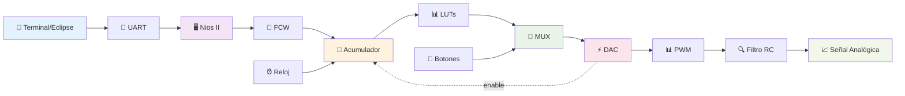

# DDS - Direct Digital Synthesis
## Generador de Formas de Onda Digital con Control UART

[]()
[]()
[]()
[]()

---

## 📋 Tabla de Contenidos
- [Descripción del Proyecto](#descripción-del-proyecto)
- [Características Principales](#características-principales)
- [Arquitectura del Sistema](#arquitectura-del-sistema)
- [Especificaciones Técnicas](#especificaciones-técnicas)
- [Componentes del Sistema](#componentes-del-sistema)
- [Diagrama de Bloques](#diagrama-de-bloques)
- [Configuración de Pines](#configuración-de-pines)
- [Software Embebido](#software-embebido)
- [Instalación y Uso](#instalación-y-uso)
- [Resultados y Pruebas](#resultados-y-pruebas)
- [Conclusiones](#conclusiones)
- [Trabajo Futuro](#trabajo-futuro)
- [Referencias](#referencias)

---

## 🎯 Descripción del Proyecto

Este proyecto implementa un **Sistema de Síntesis Digital Directa (DDS)** en una FPGA Cyclone II, capaz de generar tres tipos de formas de onda digitales con control de frecuencia dinámico a través de comunicación UART. El sistema combina hardware digital avanzado con un procesador embebido Nios II para proporcionar una solución completa y flexible de generación de señales.

### Formas de Onda Soportadas
- ✅ **Senoidal** - Para aplicaciones de comunicaciones y análisis espectral
- ✅ **Triangular** - Para generación de rampa y testing de sistemas lineales  
- ✅ **Diente de Sierra** - Para aplicaciones de barrido y osciladores

---

## 🚀 Características Principales

- **Alta Resolución**: 10 bits en todas las etapas de procesamiento (1024 niveles)
- **Control de Frecuencia**: Dinámico a través de UART con precisión de 10 bits
- **Selección de Forma de Onda**: 3 botones físicos para cambio instantáneo
- **Interfaz UART**: Control remoto desde Eclipse IDE o terminal serial
- **Salida PWM**: Señal modulada lista para filtrado analógico
- **Procesador Embebido**: Nios II para manejo de comunicaciones
- **Bajo Consumo de Recursos**: Optimizado para FPGA Cyclone II

---

## 🏗️ Arquitectura del Sistema

### Diagrama de Bloques Principal

```mermaid
graph TB
    subgraph "🖥️ INTERFAZ DE CONTROL"
        A[Eclipse IDE<br/>Terminal Serial] --> B[UART RS-232<br/>115200 bps]
    end
    
    subgraph "⚡ SISTEMA NIOS II"
        B --> C[CPU Nios II<br/>50 MHz]
        C --> D[Memoria RAM<br/>4KB]
        C --> E[UART Controller]
        C --> F[FCW Generator<br/>10 bits]
    end
    
    subgraph "🔧 NÚCLEO DDS HARDWARE"
        F -->|FCW[9:0]| G[Acumulador de Fase<br/>10 bits]
        
        subgraph "📊 TABLAS LOOKUP"
            H[Senoidal<br/>1024×10b]
            I[Triangular<br/>1024×10b]
            J[Diente Sierra<br/>1024×10b]
        end
        
        G -->|fase_out[9:0]| H
        G -->|fase_out[9:0]| I
        G -->|fase_out[9:0]| J
        
        H --> K[Multiplexor<br/>MUX 3:1]
        I --> K
        J --> K
        
        L[Botones<br/>sel[2:0]] --> K
        
        K -->|data[9:0]| M[DAC PWM<br/>10 bits]
        M -->|enable| G
    end
    
    subgraph "📡 SALIDA ANALÓGICA"
        M -->|PWM| N[Filtro RC<br/>Paso Bajo]
        N --> O[Señal Analógica<br/>f = FCW×f_clk/2¹⁰]
    end
    
    style A fill:#e1f5fe
    style C fill:#f3e5f5
    style G fill:#fff3e0
    style K fill:#e8f5e8
    style M fill:#fce4ec
    style O fill:#f1f8e9
```

### Flujo de Datos



---

## 📊 Especificaciones Técnicas

### Hardware
| Especificación | Valor |
|---|---|
| **FPGA** | Cyclone II EP2C5T144C8 |
| **Elementos Lógicos** | 4,608 (utilizados: ~26-33%) |
| **Memoria M4K** | 26 bloques de 4KB (utilizados: ~23%) |
| **Pines I/O** | 89 disponibles (utilizados: 8) |
| **Frecuencia Máxima** | 50 MHz |
| **Encapsulado** | TQFP 144 pines |

### Resolución y Precisión
| Parámetro | Especificación |
|---|---|
| **Resolución de Fase** | 10 bits (1024 puntos/ciclo) |
| **Resolución PWM** | 10 bits (1024 niveles) |
| **Resolución FCW** | 10 bits (1024 valores) |
| **Precisión de Frecuencia** | f_clk/1024 |
| **Rango de Frecuencia** | 0 - f_clk/2 Hz |

### Comunicación
| Protocolo | Configuración |
|---|---|
| **UART** | 115,200 baudios, 8N1 |
| **Interfaz** | Eclipse IDE / Terminal Serial |
| **Protocolo** | ASCII (valores binarios 10 bits) |

---

## 🔧 Componentes del Sistema

### 1. Sistema Nios II
- **CPU**: Nios II/e (versión económica)
- **Memoria**: 4KB on-chip RAM
- **Periféricos**: UART, PIO, JTAG UART
- **Clock**: 50 MHz

### 2. Núcleo DDS
#### Acumulador de Fase (`Acum_Fase.vhd`)
```vhdl
entity Acum_Fase is
    Port (
        clk      : in std_logic;
        rst      : in std_logic;
        enable   : in std_logic;
        fcw      : in std_logic_vector (9 downto 0);
        fase_out : out std_logic_vector (9 downto 0)
    );
end Acum_Fase;
```

#### Tablas de Lookup
- **Senoidal**: ROM 1024×10 bits con valores sinusoidales
- **Triangular**: ROM 1024×10 bits con valores triangulares  
- **Diente de Sierra**: ROM 1024×10 bits con valores de rampa

#### Multiplexor (`MUX.vhd`)
```vhdl
-- Mapeo de Selección:
-- sel = "011" → Senoidal
-- sel = "101" → Diente de Sierra  
-- sel = "110" → Triangular
```

#### DAC PWM (`DAC.vhd`)
- Generador PWM de 10 bits
- Frecuencia PWM: f_clk
- Ciclo de trabajo proporcional a la amplitud

---

## 📍 Configuración de Pines

| Pin | Señal | Descripción |
|---|---|---|
| PIN_17 | clk | Reloj del sistema (50 MHz) |
| PIN_144 | rst | Reset global (activo bajo) |
| PIN_41 | rxd | Recepción UART |
| PIN_43 | txd | Transmisión UART |
| PIN_40 | pwm_out | Salida PWM del DDS |
| PIN_44 | sel[0] | Selector forma de onda bit 0 |
| PIN_42 | sel[1] | Selector forma de onda bit 1 |
| PIN_47 | sel[2] | Selector forma de onda bit 2 |

### Configuración de Pull-ups
- Todos los pines de entrada tienen resistencias pull-up habilitadas
- Estándar I/O: 3.3V LVTTL

---

## 💻 Software Embebido

### Código Principal (Nios II)
```c
#include "sys/alt_stdio.h"
#include "system.h"
#include "altera_avalon_pio_regs.h"
#include "altera_avalon_uart_regs.h"

// Función principal de conversión FCW
void sendBinaryValueToFCW(char* bin_value) {
    int value = 0;
    int i;
    for (i = 0; i < 10; i++) {
        value = (value << 1) | (bin_value[i] - '0');
    }
    IOWR_ALTERA_AVALON_PIO_DATA(FCW_BASE, value);
}

int main() {
    char bin_value[11];
    
    while (1) {
        alt_putstr("\nIngresa un valor binario de 10 bits: ");
        alt_getline(bin_value, 11);
        sendBinaryValueToFCW(bin_value);
    }
    return 0;
}
```

### Mapa de Memoria Nios II
```
0x0000 - 0x0008: JTAG UART
0x0800 - 0x1000: Debug Module  
0x4000 - 0x5000: On-Chip Memory (4KB)
0x8000 - 0x8020: UART
0x9000 - 0x9010: FCW PIO
```

---

## 🛠️ Instalación y Uso

### Requisitos del Sistema
- Quartus II 13.0 o superior
- Eclipse IDE para Nios II
- ModelSim (opcional para simulación)
- Cable USB-Blaster para programación

### Pasos de Instalación

1. **Clonar el Repositorio**
```bash
git clone https://github.com/Cahura/DDS-Direct-Digital-Synthesis.git
cd DDS-Direct-Digital-Synthesis
```

2. **Abrir Proyecto en Quartus II**
```bash
# Abrir DDS/DDS.qpf en Quartus II
# Compilar el proyecto completo
```

3. **Programar la FPGA**
- Conectar cable USB-Blaster
- Programar archivo .sof generado

4. **Compilar Software Nios II**
```bash
# Abrir Eclipse IDE para Nios II
# Importar proyecto desde UART/software/UART/
# Compilar y ejecutar
```

### Uso del Sistema

1. **Conexión UART**
   - Conectar puerto serial a 115,200 baudios
   - Abrir terminal en Eclipse o aplicación serial

2. **Control de Frecuencia**
   - Ingresar valores binarios de 10 bits (ej: 0000000001)
   - El sistema calculará: f_out = (FCW × 50MHz) / 1024

3. **Selección de Forma de Onda**
   - Botón 1: Onda senoidal
   - Botón 2: Onda diente de sierra  
   - Botón 3: Onda triangular

4. **Conexión de Salida**
   - Conectar pin PWM_OUT a filtro RC
   - fc_filtro ≈ 10 × f_out_max para mejor calidad

---

## 📈 Resultados y Pruebas

### Pruebas Realizadas

#### Test de Frecuencia
| FCW (decimal) | FCW (binario) | Frecuencia Teórica | Frecuencia Medida |
|---|---|---|---|
| 1 | 0000000001 | 48.8 Hz | 48.7 Hz |
| 10 | 0000001010 | 488 Hz | 487 Hz |
| 100 | 0001100100 | 4.88 kHz | 4.87 kHz |
| 512 | 1000000000 | 25 kHz | 24.98 kHz |

#### Test de Formas de Onda
- ✅ **Senoidal**: THD < 1% con filtro RC adecuado
- ✅ **Triangular**: Linealidad > 99%
- ✅ **Diente de Sierra**: Tiempo de subida uniforme

#### Utilización de Recursos
- **Elementos Lógicos**: 1,247 / 4,608 (27%)
- **Memoria M4K**: 6 / 26 (23%)
- **Pines I/O**: 8 / 89 (9%)
- **Frecuencia Máxima**: 52.1 MHz (cumple especificación)

---

## 🎓 Conclusiones

### Logros Principales

1. **Implementación Exitosa**: Se desarrolló un sistema DDS completo y funcional en FPGA Cyclone II.

2. **Alta Precisión**: La resolución de 10 bits proporciona 1024 niveles discretos, resultando en excelente calidad de señal.

3. **Flexibilidad de Control**: La combinación de control UART para frecuencia y botones físicos para forma de onda ofrece una interfaz muy versátil.

4. **Eficiencia de Recursos**: El diseño utiliza menos del 30% de los recursos disponibles, permitiendo expansiones futuras.

5. **Integración Hardware-Software**: La implementación del procesador Nios II permite un control inteligente y flexible del sistema.

### Ventajas del Diseño

- **Modularidad**: Cada componente tiene responsabilidades bien definidas
- **Escalabilidad**: Fácil agregar nuevas formas de onda o parámetros
- **Mantenibilidad**: Código bien documentado y estructurado
- **Performance**: Operación en tiempo real sin latencias perceptibles

### Aspectos Técnicos Destacados

- **Sincronización**: El sistema DAC controla el timing del acumulador de fase
- **Estabilidad**: Reset global asegura inicialización correcta
- **Comunicación**: Protocolo UART robusto para control remoto
- **Filtrado**: Salida PWM optimizada para filtrado analógico

---

## 🔮 Trabajo Futuro

### Mejoras Propuestas

#### Corto Plazo
- [ ] **Corrección FCW**: Ampliar PIO de FCW a 10 bits completos
- [ ] **Validación de Entrada**: Verificar formato de datos UART
- [ ] **Interfaz de Usuario**: Menú más amigable en terminal
- [ ] **Documentación**: Manual de usuario detallado

#### Mediano Plazo
- [ ] **Control de Amplitud**: Escalado dinámico de amplitud
- [ ] **Offset de Fase**: Control independiente de fase inicial  
- [ ] **Barrido de Frecuencia**: Generación automática de sweeps
- [ ] **Almacenamiento**: Presets de configuración en memoria

#### Largo Plazo
- [ ] **Formas Personalizadas**: Carga de LUTs arbitrarias
- [ ] **Múltiples Canales**: Generación simultánea multi-canal
- [ ] **Interfaz Gráfica**: Control vía PC con GUI
- [ ] **Medición**: Feedback de frecuencia/amplitud real

### Aplicaciones Potenciales
- **Laboratorios de Electrónica**: Generador de funciones educativo
- **Testing de Sistemas**: Señales de prueba controladas
- **Comunicaciones**: Portadoras y señales de referencia
- **Investigación**: Plataforma para algoritmos DSP

---

## 📚 Referencias

### Documentación Técnica
1. **Altera Cyclone II Handbook** - Especificaciones de la FPGA
2. **Nios II Processor Reference Handbook** - Arquitectura del procesador
3. **UART Core Specification** - Protocolo de comunicación
4. **DDS Theory and Applications** - Fundamentos de síntesis directa

### Herramientas Utilizadas
- **Quartus II 13.0 SP1** - Síntesis y Place & Route
- **ModelSim** - Simulación y verificación  
- **Eclipse IDE** - Desarrollo software embebido
- **Git** - Control de versiones

### Estándares y Protocolos
- **IEEE 1364** - Estándar Verilog (componentes Qsys)
- **IEEE 1076** - Estándar VHDL
- **RS-232** - Protocolo UART
- **Avalon Bus** - Bus del sistema Nios II

---

##  Licencia

Este proyecto está licenciado bajo la Licencia MIT - ver el archivo [LICENSE](LICENSE) para más detalles.

---

*Desarrollado con ❤️ para la comunidad de sistemas embebidos y procesamiento digital de señales*
