# DDS - Direct Digital Synthesis
## Generador de Formas de Onda Digital con Control UART

[]()
[]()
[]()
[]()

---

## 📋 Tabla de Contenidos
- [Descripción del Proyecto](#descripción-del-proyecto)
- [Características Principales](#características-principales)
- [Arquitectura del Sistema](#arquitectura-del-sistema)
- [Especificaciones Técnicas](#especificaciones-técnicas)
- [Componentes del Sistema](#componentes-del-sistema)
- [Diagrama de Bloques](#diagrama-de-bloques)
- [Configuración de Pines](#configuración-de-pines)
- [Software Embebido](#software-embebido)
- [Instalación y Uso](#instalación-y-uso)
- [Resultados y Pruebas](#resultados-y-pruebas)
- [Conclusiones](#conclusiones)
- [Trabajo Futuro](#trabajo-futuro)
- [Referencias](#referencias)

---

## 🎯 Descripción del Proyecto

Este proyecto implementa un **Sistema de Síntesis Digital Directa (DDS)** en una FPGA Cyclone II, capaz de generar tres tipos de formas de onda digitales con control de frecuencia dinámico a través de comunicación UART. El sistema combina hardware digital avanzado con un procesador embebido Nios II para proporcionar una solución completa y flexible de generación de señales.

### Formas de Onda Soportadas
- ✅ **Senoidal** - Para aplicaciones de comunicaciones y análisis espectral
- ✅ **Triangular** - Para generación de rampa y testing de sistemas lineales  
- ✅ **Diente de Sierra** - Para aplicaciones de barrido y osciladores

---

## 🚀 Características Principales

- **Alta Resolución**: 10 bits en todas las etapas de procesamiento (1024 niveles)
- **Control de Frecuencia**: Dinámico a través de UART con precisión de 10 bits
- **Selección de Forma de Onda**: 3 botones físicos para cambio instantáneo
- **Interfaz UART**: Control remoto desde Eclipse IDE o terminal serial
- **Salida PWM**: Señal modulada lista para filtrado analógico
- **Procesador Embebido**: Nios II para manejo de comunicaciones
- **Bajo Consumo de Recursos**: Optimizado para FPGA Cyclone II

---

## 🏗️ Arquitectura del Sistema

### Diagrama de Bloques Principal

```mermaid
graph TB
    subgraph CONTROL ["🖥️ INTERFAZ DE CONTROL"]
        direction TB
        A["🖥️ Eclipse IDE<br/>📟 Terminal Serial"]
        B["📡 UART RS-232<br/>⚡ 115200 bps"]
        A ==>|Control Commands| B
    end
    
    subgraph NIOS ["⚡ SISTEMA NIOS II EMBEBIDO"]
        direction TB
        C["🧠 CPU Nios II<br/>🔄 50 MHz"]
        D["💾 Memoria RAM<br/>📦 4KB"]
        E["📨 UART Controller"]
        F["🔢 FCW Generator<br/>🎯 10 bits"]
        
        C -.-> D
        C -.-> E
        C ==> F
    end
    
    subgraph DDS ["🔧 NÚCLEO DDS HARDWARE"]
        direction TB
        G["🔄 Acumulador de Fase<br/>⚙️ 10 bits"]
        
        subgraph LUTS ["📊 TABLAS LOOKUP LUT"]
            direction LR
            H["🌊 Senoidal<br/>📈 1024x10b"]
            I["📐 Triangular<br/>📈 1024x10b"]
            J["⚡ Diente Sierra<br/>📈 1024x10b"]
        end
        
        K["🔀 Multiplexor<br/>🎛️ MUX 3:1"]
        L["🔘 Botones<br/>🎮 sel 2:0"]
        M["⚡ DAC PWM<br/>🎵 10 bits"]
        
        G ==>|fase_out 9:0| H
        G ==>|fase_out 9:0| I
        G ==>|fase_out 9:0| J
        
        H ==> K
        I ==> K
        J ==> K
        L ==> K
        
        K ==>|data 9:0| M
        M -.->|enable| G
    end
    
    subgraph OUTPUT ["📡 SALIDA ANALÓGICA"]
        direction TB
        N["🔍 Filtro RC<br/>📊 Paso Bajo"]
        O["📈 Señal Analógica<br/>🎵 f = FCW x f_clk / 2^10"]
        
        N ==> O
    end
    
    %% Conexiones principales
    B ==>|Serial Data| C
    F ==>|FCW 9:0| G
    M ==>|PWM Signal| N
    
    %% Estilos avanzados
    classDef interfaceStyle fill:#1565C0,stroke:#0D47A1,stroke-width:3px,color:#fff,font-weight:bold
    classDef niosStyle fill:#7B1FA2,stroke:#4A148C,stroke-width:3px,color:#fff,font-weight:bold
    classDef ddsStyle fill:#F57C00,stroke:#E65100,stroke-width:3px,color:#fff,font-weight:bold
    classDef lutStyle fill:#388E3C,stroke:#1B5E20,stroke-width:3px,color:#fff,font-weight:bold
    classDef outputStyle fill:#D32F2F,stroke:#B71C1C,stroke-width:3px,color:#fff,font-weight:bold
    
    class A,B interfaceStyle
    class C,D,E,F niosStyle
    class G,K,L,M ddsStyle
    class H,I,J lutStyle
    class N,O outputStyle
    
    %% Estilos de subgrafos
    style CONTROL fill:#E3F2FD,stroke:#1976D2,stroke-width:4px
    style NIOS fill:#F3E5F5,stroke:#7B1FA2,stroke-width:4px
    style DDS fill:#FFF3E0,stroke:#F57C00,stroke-width:4px
    style LUTS fill:#E8F5E8,stroke:#388E3C,stroke-width:4px
    style OUTPUT fill:#FFEBEE,stroke:#D32F2F,stroke-width:4px
```



### Flujo de Datos

```mermaid
flowchart LR
    subgraph INPUT ["📱 ENTRADA"]
        A["🖥️ Terminal<br/>Eclipse IDE"]
    end
    
    subgraph COMM ["📡 COMUNICACIÓN"]
        B["📡 UART<br/>115200 bps"]
    end
    
    subgraph PROC ["🧠 PROCESAMIENTO"]
        C["🖥️ Nios II<br/>Processor"]
        D["🔢 FCW<br/>Generator"]
    end
    
    subgraph SIGNAL ["🔄 GENERACIÓN DE SEÑAL"]
        E["⚙️ Acumulador<br/>de Fase"]
        F["📊 LUTs<br/>Lookup Tables"]
        G["🔀 MUX<br/>Selector"]
        H["🔘 Botones<br/>Control"]
    end
    
    subgraph CONV ["⚡ CONVERSIÓN"]
        I["⚡ DAC<br/>PWM"]
    end
    
    subgraph FILTER ["� FILTRADO"]
        J["� Filtro RC<br/>Paso Bajo"]
    end
    
    subgraph FINAL ["📈 SALIDA"]
        K["🎵 Señal<br/>Analógica"]
    end
    
    subgraph CLOCK ["⏰ SINCRONIZACIÓN"]
        L["🔄 Reloj<br/>Sistema"]
    end
    
    %% Flujo principal
    A ==>|Comandos| B
    B ==>|Serial Data| C
    C ==>|Control| D
    D ==>|FCW 9:0| E
    E ==>|Fase| F
    F ==>|Datos| G
    H ==>|Select| G
    G ==>|Amplitud| I
    I ==>|PWM| J
    J ==>|Filtrada| K
    
    %% Señales de control
    L -.->|Clock| E
    I -.->|Enable| E
    
    %% Estilos modernos con gradientes
    classDef inputStyle fill:linear-gradient(90deg, #2196F3, #21CBF3),stroke:#1976D2,stroke-width:3px,color:#fff,font-weight:bold
    classDef commStyle fill:linear-gradient(90deg, #4CAF50, #8BC34A),stroke:#388E3C,stroke-width:3px,color:#fff,font-weight:bold
    classDef procStyle fill:linear-gradient(90deg, #9C27B0, #E91E63),stroke:#7B1FA2,stroke-width:3px,color:#fff,font-weight:bold
    classDef signalStyle fill:linear-gradient(90deg, #FF9800, #FFC107),stroke:#F57C00,stroke-width:3px,color:#fff,font-weight:bold
    classDef convStyle fill:linear-gradient(90deg, #F44336, #FF5722),stroke:#D32F2F,stroke-width:3px,color:#fff,font-weight:bold
    classDef filterStyle fill:linear-gradient(90deg, #795548, #8D6E63),stroke:#5D4037,stroke-width:3px,color:#fff,font-weight:bold
    classDef finalStyle fill:linear-gradient(90deg, #607D8B, #90A4AE),stroke:#455A64,stroke-width:3px,color:#fff,font-weight:bold
    classDef clockStyle fill:linear-gradient(90deg, #009688, #4DB6AC),stroke:#00695C,stroke-width:3px,color:#fff,font-weight:bold
    
    class A inputStyle
    class B commStyle
    class C,D procStyle
    class E,F,G,H signalStyle
    class I convStyle
    class J filterStyle
    class K finalStyle
    class L clockStyle
    
    %% Estilos de subgrafos con efectos
    style INPUT fill:#E3F2FD,stroke:#1976D2,stroke-width:4px,stroke-dasharray: 5 5
    style COMM fill:#E8F5E8,stroke:#388E3C,stroke-width:4px,stroke-dasharray: 5 5
    style PROC fill:#F3E5F5,stroke:#7B1FA2,stroke-width:4px,stroke-dasharray: 5 5
    style SIGNAL fill:#FFF3E0,stroke:#F57C00,stroke-width:4px,stroke-dasharray: 5 5
    style CONV fill:#FFEBEE,stroke:#D32F2F,stroke-width:4px,stroke-dasharray: 5 5
    style FILTER fill:#EFEBE9,stroke:#5D4037,stroke-width:4px,stroke-dasharray: 5 5
    style FINAL fill:#ECEFF1,stroke:#455A64,stroke-width:4px,stroke-dasharray: 5 5
    style CLOCK fill:#E0F2F1,stroke:#00695C,stroke-width:4px,stroke-dasharray: 5 5
```

### Diagrama Interactivo de Arquitectura DDS

<div align="center">

```mermaid
gitgraph
    commit id: "🚀 Sistema Inicializado"
    
    branch uart-comm
    checkout uart-comm
    commit id: "📡 UART Configurado"
    commit id: "📨 Datos Recibidos"
    
    branch nios-processing
    checkout nios-processing
    commit id: "🧠 Nios II Activo"
    commit id: "🔢 FCW Generado"
    
    branch dds-core
    checkout dds-core
    commit id: "⚙️ Acumulador Funcionando"
    commit id: "📊 LUTs Accedidas"
    commit id: "🔀 MUX Seleccionado"
    
    branch output
    checkout output
    commit id: "⚡ PWM Generado"
    commit id: "🔍 Señal Filtrada"
    commit id: "🎵 Salida Analógica"
    
    checkout main
    merge uart-comm
    merge nios-processing
    merge dds-core
    merge output
    commit id: "✅ Sistema DDS Completo"
```

</div>

---

## 📊 Especificaciones Técnicas

### Hardware
| Especificación | Valor |
|---|---|
| **FPGA** | Cyclone II EP2C5T144C8 |
| **Elementos Lógicos** | 4,608 (utilizados: ~26-33%) |
| **Memoria M4K** | 26 bloques de 4KB (utilizados: ~23%) |
| **Pines I/O** | 89 disponibles (utilizados: 8) |
| **Frecuencia Máxima** | 50 MHz |
| **Encapsulado** | TQFP 144 pines |

### Resolución y Precisión
| Parámetro | Especificación |
|---|---|
| **Resolución de Fase** | 10 bits (1024 puntos/ciclo) |
| **Resolución PWM** | 10 bits (1024 niveles) |
| **Resolución FCW** | 10 bits (1024 valores) |
| **Precisión de Frecuencia** | f_clk/1024 |
| **Rango de Frecuencia** | 0 - f_clk/2 Hz |

### Comunicación
| Protocolo | Configuración |
|---|---|
| **UART** | 115,200 baudios, 8N1 |
| **Interfaz** | Eclipse IDE / Terminal Serial |
| **Protocolo** | ASCII (valores binarios 10 bits) |

---

## 🔧 Componentes del Sistema

### 1. Sistema Nios II
- **CPU**: Nios II/e (versión económica)
- **Memoria**: 4KB on-chip RAM
- **Periféricos**: UART, PIO, JTAG UART
- **Clock**: 50 MHz

### 2. Núcleo DDS
#### Acumulador de Fase (`Acum_Fase.vhd`)
```vhdl
entity Acum_Fase is
    Port (
        clk      : in std_logic;
        rst      : in std_logic;
        enable   : in std_logic;
        fcw      : in std_logic_vector (9 downto 0);
        fase_out : out std_logic_vector (9 downto 0)
    );
end Acum_Fase;
```

#### Tablas de Lookup
- **Senoidal**: ROM 1024×10 bits con valores sinusoidales
- **Triangular**: ROM 1024×10 bits con valores triangulares  
- **Diente de Sierra**: ROM 1024×10 bits con valores de rampa

#### Multiplexor (`MUX.vhd`)
```vhdl
-- Mapeo de Selección:
-- sel = "011" → Senoidal
-- sel = "101" → Diente de Sierra  
-- sel = "110" → Triangular
```

#### DAC PWM (`DAC.vhd`)
- Generador PWM de 10 bits
- Frecuencia PWM: f_clk
- Ciclo de trabajo proporcional a la amplitud

---

## 📍 Configuración de Pines

| Pin | Señal | Descripción |
|---|---|---|
| PIN_17 | clk | Reloj del sistema (50 MHz) |
| PIN_144 | rst | Reset global (activo bajo) |
| PIN_41 | rxd | Recepción UART |
| PIN_43 | txd | Transmisión UART |
| PIN_40 | pwm_out | Salida PWM del DDS |
| PIN_44 | sel[0] | Selector forma de onda bit 0 |
| PIN_42 | sel[1] | Selector forma de onda bit 1 |
| PIN_47 | sel[2] | Selector forma de onda bit 2 |

### Configuración de Pull-ups
- Todos los pines de entrada tienen resistencias pull-up habilitadas
- Estándar I/O: 3.3V LVTTL

---

## 💻 Software Embebido

### Código Principal (Nios II)
```c
#include "sys/alt_stdio.h"
#include "system.h"
#include "altera_avalon_pio_regs.h"
#include "altera_avalon_uart_regs.h"

// Función principal de conversión FCW
void sendBinaryValueToFCW(char* bin_value) {
    int value = 0;
    int i;
    for (i = 0; i < 10; i++) {
        value = (value << 1) | (bin_value[i] - '0');
    }
    IOWR_ALTERA_AVALON_PIO_DATA(FCW_BASE, value);
}

int main() {
    char bin_value[11];
    
    while (1) {
        alt_putstr("\nIngresa un valor binario de 10 bits: ");
        alt_getline(bin_value, 11);
        sendBinaryValueToFCW(bin_value);
    }
    return 0;
}
```

### Mapa de Memoria Nios II
```
0x0000 - 0x0008: JTAG UART
0x0800 - 0x1000: Debug Module  
0x4000 - 0x5000: On-Chip Memory (4KB)
0x8000 - 0x8020: UART
0x9000 - 0x9010: FCW PIO
```

---

## 🛠️ Instalación y Uso

### Requisitos del Sistema
- Quartus II 13.0 o superior
- Eclipse IDE para Nios II
- ModelSim (opcional para simulación)
- Cable USB-Blaster para programación

### Pasos de Instalación

1. **Clonar el Repositorio**
```bash
git clone https://github.com/Cahura/DDS-Direct-Digital-Synthesis.git
cd DDS-Direct-Digital-Synthesis
```

2. **Abrir Proyecto en Quartus II**
```bash
# Abrir DDS/DDS.qpf en Quartus II
# Compilar el proyecto completo
```

3. **Programar la FPGA**
- Conectar cable USB-Blaster
- Programar archivo .sof generado

4. **Compilar Software Nios II**
```bash
# Abrir Eclipse IDE para Nios II
# Importar proyecto desde UART/software/UART/
# Compilar y ejecutar
```

### Uso del Sistema

1. **Conexión UART**
   - Conectar puerto serial a 115,200 baudios
   - Abrir terminal en Eclipse o aplicación serial

2. **Control de Frecuencia**
   - Ingresar valores binarios de 10 bits (ej: 0000000001)
   - El sistema calculará: f_out = (FCW × 50MHz) / 1024

3. **Selección de Forma de Onda**
   - Botón 1: Onda senoidal
   - Botón 2: Onda diente de sierra  
   - Botón 3: Onda triangular

4. **Conexión de Salida**
   - Conectar pin PWM_OUT a filtro RC
   - fc_filtro ≈ 10 × f_out_max para mejor calidad

---

## 📈 Resultados y Pruebas

### Pruebas Realizadas

#### Test de Frecuencia
| FCW (decimal) | FCW (binario) | Frecuencia Teórica | Frecuencia Medida |
|---|---|---|---|
| 1 | 0000000001 | 48.8 Hz | 48.7 Hz |
| 10 | 0000001010 | 488 Hz | 487 Hz |
| 100 | 0001100100 | 4.88 kHz | 4.87 kHz |
| 512 | 1000000000 | 25 kHz | 24.98 kHz |

#### Test de Formas de Onda
- ✅ **Senoidal**: THD < 1% con filtro RC adecuado
- ✅ **Triangular**: Linealidad > 99%
- ✅ **Diente de Sierra**: Tiempo de subida uniforme

#### Utilización de Recursos
- **Elementos Lógicos**: 1,247 / 4,608 (27%)
- **Memoria M4K**: 6 / 26 (23%)
- **Pines I/O**: 8 / 89 (9%)
- **Frecuencia Máxima**: 52.1 MHz (cumple especificación)

---

## 🎓 Conclusiones

### Logros Principales

1. **Implementación Exitosa**: Se desarrolló un sistema DDS completo y funcional en FPGA Cyclone II.

2. **Alta Precisión**: La resolución de 10 bits proporciona 1024 niveles discretos, resultando en excelente calidad de señal.

3. **Flexibilidad de Control**: La combinación de control UART para frecuencia y botones físicos para forma de onda ofrece una interfaz muy versátil.

4. **Eficiencia de Recursos**: El diseño utiliza menos del 30% de los recursos disponibles, permitiendo expansiones futuras.

5. **Integración Hardware-Software**: La implementación del procesador Nios II permite un control inteligente y flexible del sistema.

### Ventajas del Diseño

- **Modularidad**: Cada componente tiene responsabilidades bien definidas
- **Escalabilidad**: Fácil agregar nuevas formas de onda o parámetros
- **Mantenibilidad**: Código bien documentado y estructurado
- **Performance**: Operación en tiempo real sin latencias perceptibles

### Aspectos Técnicos Destacados

- **Sincronización**: El sistema DAC controla el timing del acumulador de fase
- **Estabilidad**: Reset global asegura inicialización correcta
- **Comunicación**: Protocolo UART robusto para control remoto
- **Filtrado**: Salida PWM optimizada para filtrado analógico

---

## 🔮 Trabajo Futuro

### Mejoras Propuestas

#### Corto Plazo
- [ ] **Corrección FCW**: Ampliar PIO de FCW a 10 bits completos
- [ ] **Validación de Entrada**: Verificar formato de datos UART
- [ ] **Interfaz de Usuario**: Menú más amigable en terminal
- [ ] **Documentación**: Manual de usuario detallado

#### Mediano Plazo
- [ ] **Control de Amplitud**: Escalado dinámico de amplitud
- [ ] **Offset de Fase**: Control independiente de fase inicial  
- [ ] **Barrido de Frecuencia**: Generación automática de sweeps
- [ ] **Almacenamiento**: Presets de configuración en memoria

#### Largo Plazo
- [ ] **Formas Personalizadas**: Carga de LUTs arbitrarias
- [ ] **Múltiples Canales**: Generación simultánea multi-canal
- [ ] **Interfaz Gráfica**: Control vía PC con GUI
- [ ] **Medición**: Feedback de frecuencia/amplitud real

### Aplicaciones Potenciales
- **Laboratorios de Electrónica**: Generador de funciones educativo
- **Testing de Sistemas**: Señales de prueba controladas
- **Comunicaciones**: Portadoras y señales de referencia
- **Investigación**: Plataforma para algoritmos DSP

---

## 📚 Referencias

### Documentación Técnica
1. **Altera Cyclone II Handbook** - Especificaciones de la FPGA
2. **Nios II Processor Reference Handbook** - Arquitectura del procesador
3. **UART Core Specification** - Protocolo de comunicación
4. **DDS Theory and Applications** - Fundamentos de síntesis directa

### Herramientas Utilizadas
- **Quartus II 13.0 SP1** - Síntesis y Place & Route
- **ModelSim** - Simulación y verificación  
- **Eclipse IDE** - Desarrollo software embebido
- **Git** - Control de versiones

### Estándares y Protocolos
- **IEEE 1364** - Estándar Verilog (componentes Qsys)
- **IEEE 1076** - Estándar VHDL
- **RS-232** - Protocolo UART
- **Avalon Bus** - Bus del sistema Nios II

---

##  Licencia

Este proyecto está licenciado bajo la Licencia MIT - ver el archivo [LICENSE](LICENSE) para más detalles.

---

*Desarrollado para la comunidad de sistemas embebidos y procesamiento digital de señales*
